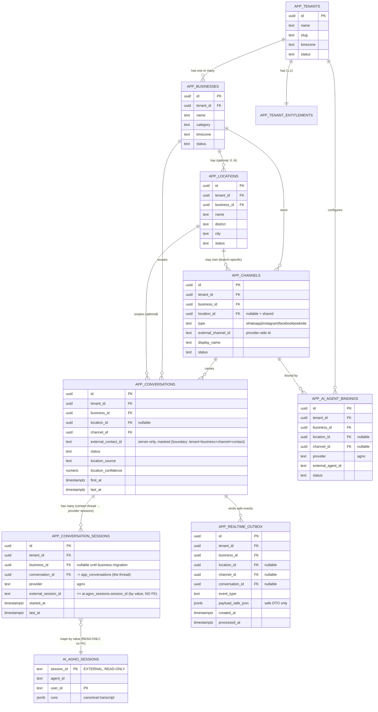

# 09 — Multi-Business / Branch / Channel / Conversation Strategy

- **Project:** pepper-st-dashboard
- **Status:** **Architecture contract (target model). Documentation-only finalization gate — no code, no
  migration, no `ai.*` change, no commit/push.** Implementation is approval-gated.
- **Date:** 2026-06-16 (refined 2026-06-17 — ADR-0016 contact-thread boundary)
- **Authority:** this document + **ADR-0015** + **ADR-0016** are the **authoritative** business-hierarchy
  + conversation-boundary contract. Vocabulary source of truth: `CONTEXT.md`. *(The earlier
  `main-stratergy.md` product-strategy draft was **deleted as stale** and not recreated — superseded by
  this document + ADR-0015 + ADR-0016.)*
- **Supersedes the model in:** `architecture/04-multitenancy.md` "Tenant → channel → conversation" and
  the `tenant ≈ business` assumption in `architecture/01-data-model.md` (both annotated to point here).
- **Refined by ADR-0016 (2026-06-17):** the **Conversation is a customer/contact thread**; each Agno
  session is an internal **provider session** under it (`app_conversation_sessions`). See §2, §3.5, §4, §5.

> **The one rule future work must not break:** the dashboard is
> **`Tenant → Business → optional Location → Channel → Conversation (Contact Thread) → Provider Sessions → Agno Session`**
> — **not** `Tenant → Channel → Conversation`, **`tenant ≠ business`**, and **one conversation (contact
> thread) may contain MANY Agno/provider sessions** (NOT one-session-per-conversation — ADR-0016).

---

## 1. Purpose

Define a future-proof business structure that works for **PEPPER ST. today** (one business, maybe no
branches) **and** for larger customers later — bakery chains, supermarkets, franchises, multi-brand
groups, online-only brands, multi-channel sales teams — **without re-architecting**.

The system must **not** assume any of:

```txt
tenant = business
business = branch
branch = WhatsApp number
WhatsApp number = customer identity
one business = one channel
one channel = one branch
```

---

## 2. The hierarchy (locked)

```txt
TENANT                         SaaS account / billing / owner boundary
  └── BUSINESS / BRAND         a brand, shop, or business line inside the tenant
        └── LOCATION / BRANCH  a branch / store / outlet / pickup location  (OPTIONAL)
              └── CHANNEL       a customer entry point: WhatsApp / Instagram / Facebook / Website
                    └── CONVERSATION / CONTACT THREAD   one customer/contact chat (one row per contact)
                          └── PROVIDER SESSIONS         the contact's Agno/provider sessions (app_conversation_sessions)
                                └── AI / AGNO SESSION    AI source-of-truth history (external, READ-ONLY)
```

| Level | Meaning |
|---|---|
| **Tenant** | SaaS account / billing / owner boundary. **Not** a business, branch, channel, or customer. |
| **Business** | A brand / shop / business line inside a tenant. A tenant may have **one or many**. |
| **Location** | A branch / store / outlet / pickup location under a business. **Optional** (0..N). |
| **Channel** | A real external customer entry point (one row per real account/number/page/widget). |
| **Conversation / Contact Thread** | One customer/contact chat — **one row per contact** in `app_conversations`, owned by tenant + business + channel + `external_contact_id` (+ optional location). **May contain many provider sessions** (ADR-0016). |
| **Provider Session** | One Agno/provider session segment under a thread — a row in `app_conversation_sessions` linking **by value** to one `ai.agno_sessions.session_id`. |
| **Agno Session** | A row in `ai.agno_sessions` — external, **read-only**; linked **by value** via `app_conversation_sessions.external_session_id`. |

---

## 3. Rules

### 3.1 Tenant ↔ Business
- A tenant **starts with one default business** (single-business customers stay simple).
- The schema **must not assume `tenant = business`** — a tenant can add businesses later.
- A business belongs to **exactly one** tenant.
- **Onboarding order:** create tenant → create **default business** → create locations (if provided) →
  create channels (if connected) → create **AI agent bindings** → create entitlements/subscription.

```txt
Simple:   Tenant: PEPPER ST            Future:  Tenant: Sameen Group
          Business: PEPPER ST Fashion           Business: Sameen Bakery
                                                 Business: Sameen Cafe
                                                 Business: Sameen Catering
```

### 3.2 Business ↔ Location (branch is OPTIONAL)
- A business may have **zero, one, or many** locations.
- `location_id = NULL` means **"not applicable or not known yet"**, **not** "branches are ignored".
- Online-only businesses and shared channels legitimately carry `NULL`.
- A branch is **not** a separate business unless the customer explicitly wants that.

### 3.3 Channel — `type` vs `external_channel_id`
A business **or** branch can have many channels. **Each real external account/number/page/widget is its
own `app_channels` row.** Keep the platform and the provider id **separate**:

```txt
type                = whatsapp | instagram | facebook | website | …   (platform)
external_channel_id = the provider-side id                            (NOT the platform name)
```

| `type` | `external_channel_id` (example) |
|---|---|
| whatsapp | Meta `phone_number_id` |
| instagram | Instagram business-account id |
| facebook | Facebook page id |
| website | website widget / site id |

**Wrong:** `external_channel_id = "whatsapp"`. A channel may be **branch-specific**
(`location_id = <branch>`) or **shared** (`location_id = NULL`, serves the whole business).

### 3.4 Branch-aware routing = PREMIUM
- **Basic plan:** one central business inbox; branch captured **if** known; no advanced routing.
- **Premium plan:** route conversations to the correct branch; branch-specific inbox, analytics, staff
  permissions, AI context, and stock/offers/pickup/delivery handling.
- **Branch resolution** (record `location_source` + `location_confidence`):

```txt
branch-specific channel · branch-specific QR/link · customer selection · AI asks ·
message text · delivery address / nearest branch · customer history · manual staff correction
```

Example: customer messages a **shared** WhatsApp → AI asks "Colombo, Kandy, or Galle?" → customer picks
Kandy → `conversation.location_id = Kandy`, `location_source = customer_selection`,
`location_confidence = high` → Kandy branch inbox + analytics update in realtime.

### 3.5 Conversation ownership (hard rule — contact thread; ADR-0016)
A **conversation is a customer/contact thread**: **one row per contact**, not one row per Agno session.
Every conversation **MUST** have `tenant_id`, `business_id`, `channel_id`, `external_contact_id`. It
**MAY** have `location_id = NULL` until the branch is resolved (or for shared/non-branch channels).

```txt
Conversation boundary (post-business): tenant_id + business_id + channel_id + external_contact_id
Conversation boundary (transitional) : tenant_id + channel_id + external_contact_id
```

The contact's Agno/provider sessions are **child rows** in `app_conversation_sessions`; the cross-schema
link is **by value, no FK**:

```txt
app_conversation_sessions.external_session_id  ==  ai.agno_sessions.session_id   (NO FK to ai.*)
```

`external_contact_id` is **server-side only** and **never** exposed raw to the browser. **Do not** put
`agno_session_id` on `app_conversations` as the boundary anymore — that was the old one-session model
(ADR-0016 supersedes `1 Agno session = 1 dashboard conversation`).

### 3.6 Customer identity across channels
A customer may contact the same business from different platforms (WhatsApp, then Instagram). **Default:
treat as separate conversations — do not auto-merge.** A future identity resolver may merge **only** with
strong evidence (verified phone, logged-in account, same order/profile, manual staff merge, customer
confirmation, high-confidence AI match). Dashboard-side identity tables stay **deferred** (ADR-0012).

---

## 4. Target dashboard-owned schema

```txt
dashboard.app_tenants
dashboard.app_businesses          (NEW)
dashboard.app_locations           (NEW)
dashboard.app_channels            (+ business_id, + location_id NULLABLE, + type, + external_channel_id)
dashboard.app_conversations       (CONTACT THREAD: + business_id, + location_id NULLABLE, + location_source/confidence; − agno_session_id)
dashboard.app_conversation_sessions (NEW — ADR-0016: provider session links; external_session_id == ai.agno_sessions.session_id by value)
dashboard.app_ai_agent_bindings   (NEW)
dashboard.app_realtime_outbox     (NEW)
dashboard.app_tenant_entitlements (existing — plan/entitlement config)
```

**Optional later (only when staff permissions ship):** `app_users`, `app_user_business_access`,
`app_user_location_access`, `app_user_channel_access`.

### 4.1 Table responsibilities

- **app_tenants** — the SaaS account (`name`, `slug`, `timezone`, `status`).
- **app_businesses** — a brand/business line under a tenant (`tenant_id`, `name`, `category`,
  `timezone`, `status`). Single-business tenants get one **default** business at onboarding.
- **app_locations** — a branch/store/outlet (`tenant_id`, `business_id`, `name`, `district`, `city`,
  `status`). A business may have **zero** locations.
- **app_channels** — a real external entry point (`tenant_id`, `business_id`, `location_id` *nullable*,
  `type`, `external_channel_id`, `display_name`, `status`). `business_id` always known; `location_id`
  NULL ⇒ shared channel.
- **app_conversations** — one **customer/contact thread** (`tenant_id`, `business_id`, `location_id`
  *nullable*, `channel_id`, `external_contact_id` *server-only, masked*, `status`, `location_source`,
  `location_confidence`, `first_at`/`last_at` *rolled up across the thread's sessions*). **No
  `agno_session_id`** here anymore (ADR-0016) — session links live in `app_conversation_sessions`.
  Boundary: `tenant_id + business_id + channel_id + external_contact_id` (transitional: without
  `business_id`).
- **app_conversation_sessions** *(NEW — ADR-0016)* — the **provider session links** for a thread
  (`tenant_id`, `business_id` *nullable until business migration*, `conversation_id`, `provider` default
  `'agno'`, `external_session_id`, `started_at`, `last_at`). `external_session_id` maps **by value** to
  `ai.agno_sessions.session_id` (**no FK to `ai.*`**); `unique(tenant_id, provider, external_session_id)`.
- **app_ai_agent_bindings** — maps a dashboard scope to an external AI/Agno agent id (`tenant_id`,
  `business_id`, `location_id` *nullable*, `channel_id` *nullable*, `provider`, `external_agent_id`,
  `status`). **Do not hard-code the Agno `agent_id` format in app logic** — resolve it here. Supports one
  agent per business / per channel / per branch, or one shared agent for many channels, and provider
  changes without schema redesign.
- **app_realtime_outbox** — safe realtime events for durable SSE delivery/recovery (`tenant_id`,
  `business_id`, `location_id` *nullable*, `channel_id` *nullable*, `conversation_id` *nullable*,
  `event_type`, `payload_safe_json`, `created_at`, `processed_at`). **Stores safe IDs + UI-ready DTOs
  only** — never raw phone, raw `runs`, `agno_session_id`, or `external_contact_id`.

---

## 5. Diagrams

### 5.1 Visual map

```txt
TENANT  (PEPPER ST Group)
│
└── BUSINESS  (PEPPER ST Fashion)
    │
    ├── LOCATION  (Colombo Store)
    │   ├── CHANNEL  WhatsApp Colombo  ── Conversation/Contact Thread ── Provider Sessions ── Agno Session(s)
    │   └── CHANNEL  Facebook Page     ── Conversation/Contact Thread ── Provider Sessions ── Agno Session(s)
    │
    ├── LOCATION  (Kandy Store)
    │   └── CHANNEL  WhatsApp Kandy    ── Conversation/Contact Thread ── Provider Sessions ── Agno Session(s)
    │
    └── SHARED CHANNELS  (Instagram / Website / Shared WhatsApp)
        └── Conversation/Contact Thread  (location_id = NULL first; assigned later if needed)
            └── Provider Sessions ── Agno Session(s)   (ONE thread, MANY sessions — ADR-0016)
```

### 5.2 Mermaid ERD



---

## 6. Incoming message resolution (scope order)

```txt
1. Resolve channel from (external_channel_id + type)
2. Resolve tenant + business from app_channels
3. Resolve location IF the channel is branch-specific (else NULL, resolve later)
4. Resolve/create the CONTACT THREAD by (tenant[, business], channel, external_contact_id)
5. Link the Agno/provider session to that thread by value (app_conversation_sessions.external_session_id)
6. Emit a SAFE realtime event scoped to the thread's conversation_id (scope ids + safe delta)
```

```txt
WhatsApp branch-specific:  external_channel_id = phone_number_id_kandy
  → channel → business = Sameen Bakery, location = Kandy → conversation.location_id = Kandy

Instagram shared:          external_channel_id = ig_business_account_main
  → channel → business = Sameen Bakery, location = NULL → branch resolved later (or never)
```

---

## 7. Agno boundary (reaffirmed — ADR-0004/0015)

`ai.*` is **read-only**. Never migrate/alter/drop/truncate/write `ai.agno_sessions`, `ai.customers`,
`ai.agno_metrics`, or any `ai.*`. Mapping is **by value only**:

```txt
dashboard.app_conversation_sessions.external_session_id  =  ai.agno_sessions.session_id   (ADR-0016; by value)
```

**No FK from `dashboard.*` to `ai.*`.** The Agno **`agent_id` shape is not hard-coded** into app logic —
it is resolved via `app_ai_agent_bindings`:

```txt
ai.agno_sessions.agent_id → app_ai_agent_bindings.external_agent_id → tenant / business / location / channel
```

---

## 8. Realtime strategy (scope-aware — extends ADR-0014)

- **Transport stays SSE** (one-way, read-only). **No WebSocket** unless/until Phase-2 human handover is
  approved (ADR-0009). **No DB `LISTEN/NOTIFY`** on `ai.*`. **No Redis/queue** for now (in-memory bus;
  the **durable `app_realtime_outbox`** is the target for delivery/recovery, added with the schema).
- **Current detector = in-process polling** (ADR-0014); **Agno webhook = future-preferred** migration
  (swaps the detector without changing the SSE contract).
- **Events target the CONTACT THREAD (ADR-0016)** — they carry `tenant_id`, `business_id`,
  `location_id` *(nullable)*, `channel_id`, and the safe `conversation_id` (the thread the UI patches);
  `external_contact_id` and `provider_session_id` are **server-side only**. A **new provider session for
  an existing contact is a thread update, never a new row.** UI updates through **safe deltas/patches**.
- **The browser must NOT** refetch `/api/dashboard`, `/api/analytics`, or `/api/chat-monitor` for every
  message, clear UI, show a global loader, flicker cards/charts, or reset the selected chat.
- **PII-safe payloads only:** **no** raw phone / `user_id` / `external_contact_id` / `agno_session_id` /
  `external_session_id` / `provider_session_id` / raw `runs` / `session_data`. (Message text + previews
  are allowed — already shown, not raw ids.)

```txt
platform/app/DB change
  → server creates/updates dashboard metadata (read-only ai.* → app_conversations)
  → server writes a SAFE realtime outbox event (scope ids + safe DTO)
  → SSE pushes the event to the browser
  → browser patches local state for the relevant scope only
```

UI scope rule: when an event arrives, update **only the currently relevant view**. *Example:* viewing the
Kandy branch dashboard while a Colombo message arrives — Kandy must **not** rerender; the tenant total
may update **if visible**.

---

## 9. Dashboard / Analytics & Chat Monitor (scope-aware)

**Filters must support:** tenant total · business total · location/branch total · channel total · date
range. Realtime event scope (`tenant/business/location/channel/conversation`) drives which view updates.

**Chat Monitor must feel like WhatsApp** (carried from `CONTEXT.md` §8.1, now scope-aware): never clear
the list, never reset the selected chat, never reload the full transcript per message — **append only
missing messages**, **dedupe by stable id**, keep bottom if at bottom, show a **"New messages"**
indicator otherwise, and keep **branch/channel badges stable**. The conversation list row shows: customer
display name · channel badge · business/location (if relevant) · last-message preview · last-message
time · status.

**Read-path (ADR-0016 — contact thread):**

```txt
List:       one row per app_conversations CONTACT THREAD
            preview = latest displayable message across ALL linked provider sessions
            last_at = max(message/session timestamp) across the thread
Transcript: load ALL app_conversation_sessions for the thread
            read matching ai.agno_sessions by external_session_id (READ-ONLY)
            parse → exclude system/tool/internal/from_history
            DEDUPE by stable provider message id (Agno m.id), sort by created_at/ts
            render ONE continuous thread
```

The current positional `safeMessageId(conversationId, index)` is **not stable** once sessions merge —
replace it with an **opaque id derived from the stable provider message id** (never the raw id).

---

## 10. Migration strategy — expand → backfill → verify → enforce

**Existing data must not be deleted. `ai.*` must not be touched.**

1. **Expand** — add `app_businesses`, `app_locations`, `app_ai_agent_bindings`, `app_realtime_outbox`;
   add **nullable** `business_id` + `location_id` to `app_channels` and `app_conversations`.
2. **Backfill** — create the **default business** under the existing PEPPER ST. tenant; map existing
   channels + conversations to it; keep `location_id = NULL` unless the branch is known.
3. **Verify** — all existing conversations + channels preserved; every conversation has
   `tenant_id`/`business_id`/`channel_id`; Agno sessions untouched; no customer/chat data deleted;
   counts reconciled **before** enforcing constraints.
4. **Enforce** — make `business_id` NOT NULL where required, `channel_id` NOT NULL on conversations, add
   dashboard-only FKs + indexes for `tenant/business/location/channel`. **No FK to `ai.*`.**

**Contact-thread migration (ADR-0016) — same `expand → backfill → verify → enforce` pattern, separately
sequenced:** *expand* add `app_conversation_sessions`; *backfill* one session-link row per existing
conversation (`external_session_id` = old `agno_session_id`), then **collapse** conversations sharing the
boundary key into **one thread per contact** (re-point session links; roll up `first_at`/`last_at`);
*verify* `ai.*` unchanged, every session linked once, threads == distinct contacts, message counts
preserved, no raw PII; *enforce* remove `agno_session_id` from `app_conversations`, add the contact-thread
uniqueness, keep `unique(tenant_id, provider, external_session_id)`. Full detail: **ADR-0016 §5**.

---

## 11. What this contract locks (and removes)

**Locked:** `tenant ≠ business`; tenant → many businesses; business → 0..N locations; channel `type`
separate from `external_channel_id`; **conversation = contact thread** owning
`tenant_id`+`business_id`+`channel_id`+`external_contact_id` (optional `location_id`), with Agno/provider
sessions as `app_conversation_sessions` children (ADR-0016); Agno read-only + by-value mapping
(`app_conversation_sessions.external_session_id`) + bindings table (no hard-coded `agent_id`); realtime
scoped to the thread + safe-delta over SSE; migration is non-destructive (expand→backfill→verify→enforce).

**Removed assumptions:** `tenant = business`; `Tenant → Channel → Conversation` as the whole model;
**`1 Agno session = 1 dashboard conversation`** (ADR-0016 — a conversation is a contact thread with many
sessions); `agno_session_id` on `app_conversations` as the boundary; platform name stored as
`external_channel_id`; branch implied by the WhatsApp number; one business = one channel; hard-coded Agno
`agent_id` format.

---

## 12. Next implementation steps (approval-gated — NOT in this gate)

1. **Schema migration proposal** — Drizzle migration for the **8-table** target (incl.
   `app_conversation_sessions`, ADR-0016) via expand→backfill→verify→enforce (+ verifier updates).
   **Do not run yet.**
2. **Onboarding flow update** — tenant → default business → locations → channels → agent bindings →
   entitlements.
3. **Realtime scope update** — extend the ADR-0014 event contract with `business/location/channel` scope
   ids + safe deltas; add `app_realtime_outbox`; keep SSE.
4. **UI filters update** — business/location/channel filters on Dashboard/Analytics + business/location
   badges in Chat Monitor.
5. **Chat Monitor read-path update (ADR-0016)** — list one row per contact thread; transcript merges all
   linked provider sessions, dedupe by a stable provider message id, replace the positional
   `safeMessageId`. **Do not implement yet.**

> **Do not begin any of the above until this contract (ADR-0015 + ADR-0016 + this doc) is approved.**
