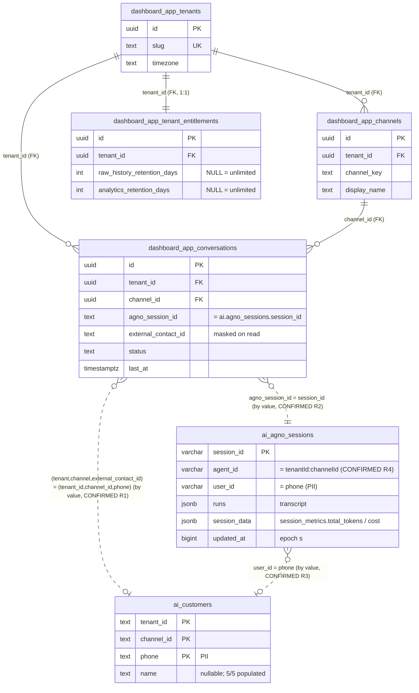
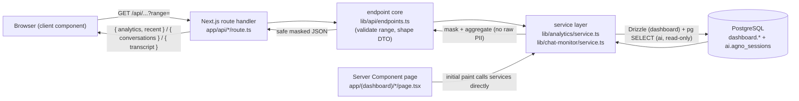
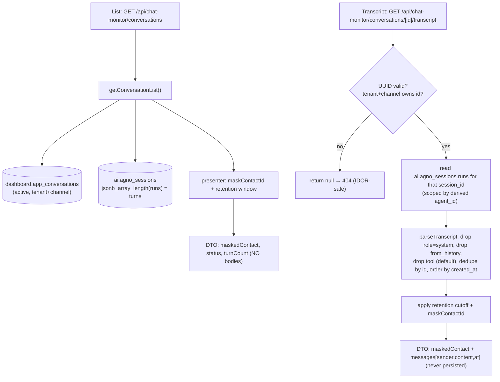
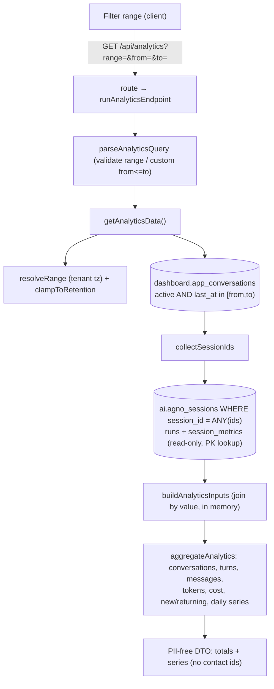

# V2 / 02 — Relationships & Data Flow

> All links below are **by value** across schemas (there is **no foreign key into
> `ai.*`**). FK-backed links exist only *within* the `dashboard` schema. Cross-schema
> links labelled **CONFIRMED** were verified by read-only `count(*)` joins on
> 2026-06-16; links labelled **TO VERIFY** are unproven.

## Confirmation evidence (read-only counts, PII-free)

| Check | Join | Result |
|---|---|---|
| R1 | `app_conversations ⋈ ai.customers` on `(tenant_id::text, channel_id::text, external_contact_id) = (tenant_id, channel_id, phone)` | **6 matched** → CONFIRMED |
| R2 | `app_conversations ⋈ ai.agno_sessions` on `agno_session_id = session_id` | **4 matched** → CONFIRMED (active/live subset) |
| R3 | `ai.agno_sessions ⋈ ai.customers` on `user_id = phone` | **5 matched** → CONFIRMED |
| R4 | `ai.agno_sessions.agent_id = (tenant_id::text || ':' || channel_id::text)` | **6 matched** → CONFIRMED (agent_id format) |
| R5 | `app_conversations` totals | 17 conversations, 15 distinct contacts |

---

## A. Database relationship map

Legend: solid = **FK** (within `dashboard`); dashed = **by-value** link (cross-schema,
no FK). Entity names use `_` for the schema dot (e.g. `ai_agno_sessions` =
`ai.agno_sessions`).

**Derived (not a column link):** `ai.agno_sessions.agent_id = "<tenant_id>:<channel_id>"`
(tenant-first), derived from the dashboard's own `app_tenants.id` + `app_channels.id`
(`lib/agno/mapping.ts::deriveExpectedAgentId`). CONFIRMED (R4 = 6/6).

**`ai.agno_metrics` — relationship TO VERIFY.** Table is **empty (0 rows)**, so no
row-level link can be observed. *Expected* link would be by `date` (+ `aggregation_period`)
and an agent/tenant key — **TO VERIFY** with the AI dev once it is populated. It is **not**
drawn above because no relationship is confirmed.

---

## B. App request flow (Browser → … → safe DTO → UI)

- **Tenant/channel are resolved server-side** in the services; the client query is read
  for `range`/`from`/`to` **only** (`lib/api/query.ts`). Any client-supplied tenant/channel
  id is ignored.
- **Initial paint is SSR** (the page calls the services directly); **subsequent filter
  changes are client `fetch`** to the API routes (ADR-0013).

---

## C. Chat Monitor flow (id → resolve session → runs → masked transcript)

Transcript **source = `ai.agno_sessions.runs`**, parsed **live in memory**, never stored
in `dashboard.*` (ADR-0004). See `05` for masking/IDOR detail.

---

## D. Analytics flow (range → aggregates → safe DTO)

- **Universe grain = CONVERSATION/SESSION**, narrowed at the DB by the indexed
  `app_conversations.last_at`, then joined **by value** to `ai.agno_sessions` by
  `session_id` (PK).
- **Token/cost come from `session_data.session_metrics` (session lifetime totals)**, and
  the daily series buckets a whole conversation on its single `last_at` day — see `04` for
  why this makes date-sliced metrics approximate.
